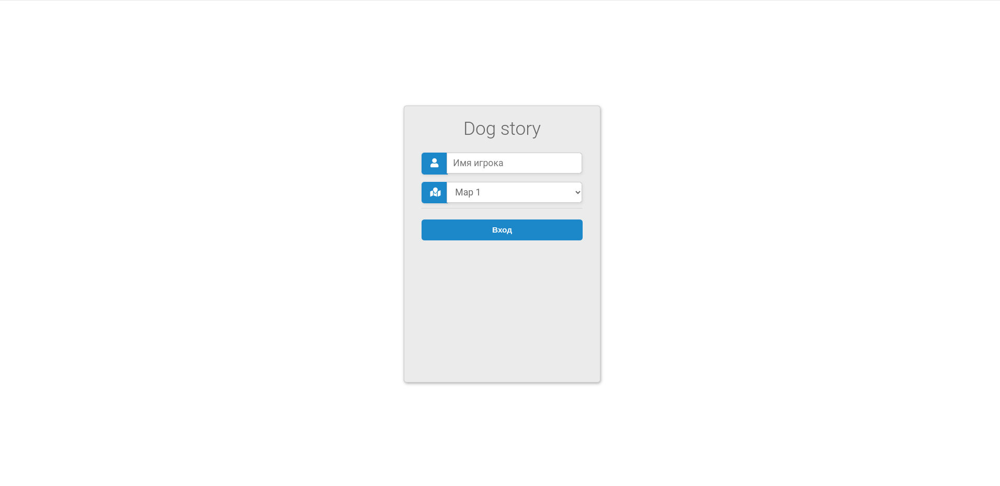
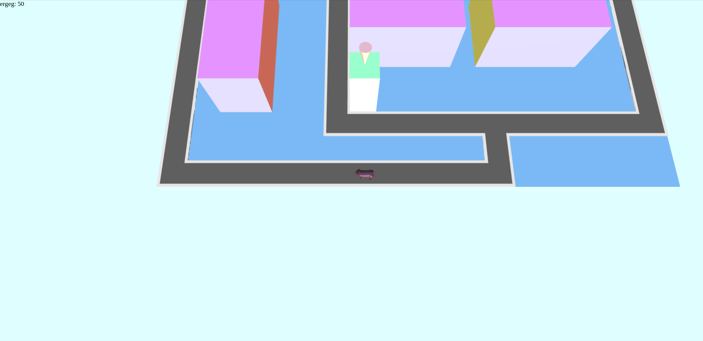
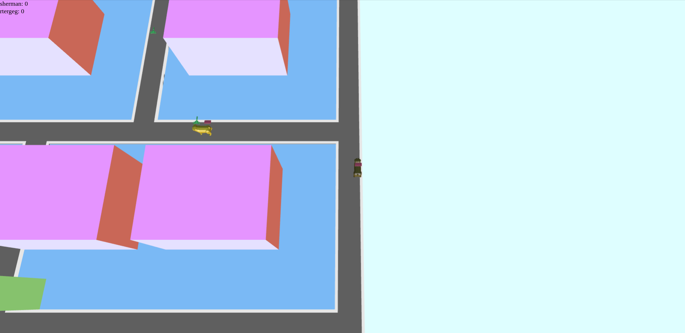
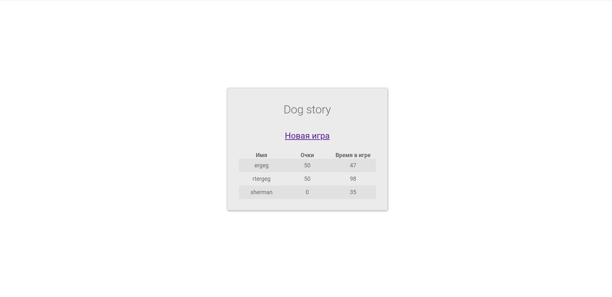

# Dog Story
Бэкенд для многопользовательской игры. Проект, реализованный в рамках курса 
«C++ для бэкенда» на Яндекс.Практикуме.

## Оглавление:
* **[Правила игры](#правила-игры)**
* **[Скриншоты](#скриншоты)**
* **[Сборка и запуск](#сборка-и-запуск)**
    * **[Клонирование репозитория](#клонирование-репозитория)**
    * **[Настройка и запуск БД](#настройка-и-запуск-БД)**
    * **[Настройка и запуск сервера](#настройка-и-запуск-сервера)**
    * **[Примечание](#примечание)**

## Правила игры:
Игрок вводит имя, выбирает карту и подключается к игровой сессии в качестве 
собаки. В игровой сессии разбросаны предметы, которые игрок может положить в
рюкзак и отнести в бюро находок. За каждый предмет, сданный в бюро находок, 
этот игрок получает очки. Цель игрока &mdash; собрать как можно больше 
предметов и набрать наибольшее число очков.

На картах существуют ограничения по времени бездействия. Время бездействия 
собаки &mdash; непрерывный промежуток времени, в течение которого скорость пса 
была равна нулю. Если игрок превышает данное ограничение, то его собака 
считается "выбывшей" и удаляется из игровой сессии, а трудовые заслуги пса 
(имя, набранные очки и время, которое пес провел в игровой сессии с момента 
входа в игровую сессию и до момента выхода на заслуженный отдых) записываются 
в таблицу рекордов.

В зависимости от карты у собак может меняться скорость передвижения, 
вместимость рюкзака и время бездействия. 

## Скриншоты:

## Сборка и запуск:
Сборку и запуск рекомендуется выполнять пошагово: так, как это написано в 
**[оглавлении](#оглавление)**. 

Для сборки потребуется **Docker**.

### Клонирование репозитория:
Чтобы склонировать репозиторий и сразу перейти в него, необходимо выполнить 
команду:

`git clone https://github.com/Sherman-m/dog_story.git && cd dog_story`

### Настройка и запуск БД:
В качестве СУБД используется **PostgreSQL**.

Перед тем, как разворачивать **docker**-контейнер с сервером, нужно развернуть 
**docker**-контейнер с СУБД `postgres`. Это можно сделать следующей командой:

`docker container run -d --name game_db -p 30432:5432 -e TZ=UTC -e 
POSTGRES_PASSWORD=PASSWORD -e POSTGRES_USER=USERNAME -e POSTGRES_DB=DB_NAME
postgres`

Значение некоторых важных параметров:

* `-p 30432:5432` &ndash; перенаправление порта 30432 на порт 5432 контейнера. 
                          Именно 5432 порт сервер PostgreSQL открывает при 
                          запуске.

* `-e TZ=UTC` &ndash; выставление временной зоны.

* `-e POSTGRES_PASSWORD=PASSWORD` &ndash; пароль для пользователя СУБД 
                                          `postgres`. Это обязательное поле.

* `-e POSTGRES_USER=USERNAME` &ndash; имя пользователя c правами администратора 
                                      СУБД и паролем, указанным в 
                                      `POSTGRES_PASSWORD`. Если пропустить этот 
                                      параметр, то автоматически будет создан 
                                      пользователь `postgres`.

* `-e POSTGRES_DB=DB_NAME` &ndash; имя основной базы данных, используемое 
                                   вместо `postgres`.
    
### Настройка и запуск сервера:
Cледующий шаг после запуска БД &mdash; добавить данные о БД в 
**[скрипт для запуска сервера](./server_starter.sh)**.

В строке `export GAME_DB_URL="postgres://USERNAME:PASSWORD@$(printenv 
DOCKER_HOST_IP):30432/DB_NAME"` требуется вместо `USERNAME`, `PASSWORD` и
`DB_NAME` написать данные параметров `POSTGRES_USER`, `POSTGRES_PASSWORD` и 
`POSTGRES_DB`, указанные при запуске **docker**-контейнера с образом СУБД 
`postgres`, соотвественно.

Далее, необходимо собрать образ сервера. Это можно сделать командой:

`docker build -t dog_story .`

Для запуска сервера достаточно команды:

`docker container run --rm -it --name server -p 80:8080 dog_story`

Значение некоторых важных параметров:

* `--rm` &ndash; удаление контейнера по завершении работы.

* `-it` &ndash; запуск контейнера в интерактивном режиме; нужен для отображения 
                логов сервера.

* `-p 80:8080` &ndash; перенаправление порта 80 на порт 8080 контейнера.

Параметры, с которыми сервер запускается по умолчанию, можно посмотреть в 
**[Dockerfile](./Dockerfile)** (инструкция **CMD**).

Можно передавать свои параметры в конце команды для запуска сервера, которые 
будут переопределять параметры по умолчанию. Полный список всех доступных 
параметров можно узнать с помощью ключа `-h`.

Чтобы зайти в игру, нужно перейти по адресу **[localhost](http://localhost)**.

### Примечание:
* Информация о скорости собак, вместимости рюкзака и времени бездействия 
  находится в **[конфигурационном файле](./data/config.json)**.

* Переменная окружения `DOCKER_HOST_IP` в 
  **[скрипте для запуска сервера](./server_starter.sh)** нужна для связки
  сервера и БД, которые работают в разных **docker**-контейнерах.

* Если при переопределении парамтеров запуска сервера не указывать параметр 
  `--tick-period`, то для обновления состояния игры можно использовать
  следующую **конечную точку**: `/api/v1/game/tick`.

* Описание **API** находится в файле
  **[api_handler.h](./src/http_handler/api_handler.h)**.
